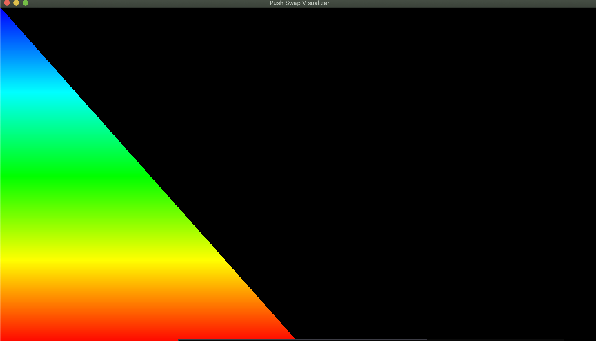

# Push_swap

**Push_swap** is a project from the 42 curriculum that focuses on sorting a stack of integers using a set of predefined operations. The goal is to implement an efficient algorithm with as few moves as possible.

## 📝 Project Description

The objective is to sort a stack of integers in ascending order using the following operations:

- **sa**: Swap the first two elements of stack `a`.
- **sb**: Swap the first two elements of stack `b`.
- **ss**: Perform `sa` and `sb` simultaneously.
- **pa**: Push the top element of stack `b` onto stack `a`.
- **pb**: Push the top element of stack `a` onto stack `b`.
- **ra**: Rotate stack `a` (the first element becomes the last).
- **rb**: Rotate stack `b`.
- **rr**: Perform `ra` and `rb` simultaneously.
- **rra**: Reverse rotate stack `a` (the last element becomes the first).
- **rrb**: Reverse rotate stack `b`.
- **rrr**: Perform `rra` and `rrb` simultaneously.

The program must work for any number of integers, and the challenge lies in minimizing the number of operations.

---

## 🚀 How to Use

### 1. **Clone the Repository**
   ```bash
   git clone https://github.com/your-username/push_swap.git
   cd push_swap
   make
   ./pushswap + {your random set of integers}
  
  


